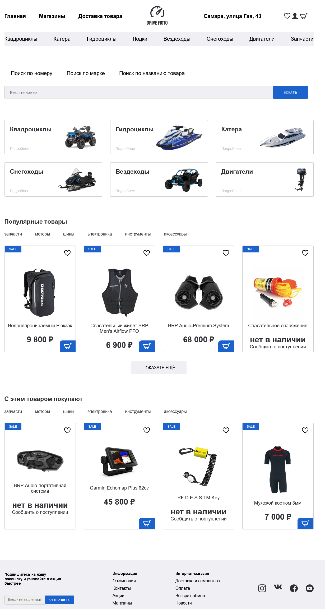
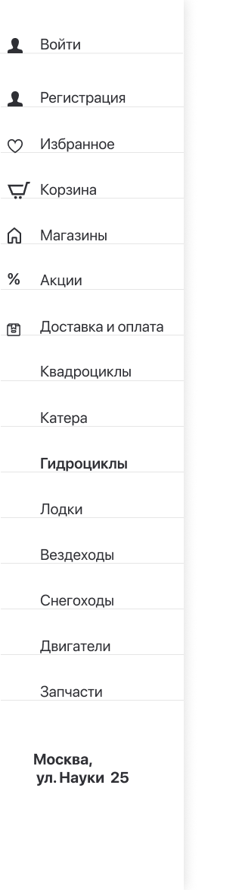

# Сайт по продаже техники
## О сайте
Сайт по продаже техники имеет большую актуальность в современном
мире, где технологии играют важную роль в повседневной жизни людей. С 
каждым годом на рынок выходит все больше новых устройств и технических 
новинок, которые становятся доступными для широкой аудитории. Поэтому 
сайты по продаже техники помогают людям быстро и удобно выбирать 
покупать необходимые устройства.

Чтобы заинтересовать пользователей, на сайте размещен каталог 
основных товаров, а также мотивирующие рекомендации к покупке товаров, 
которые они могу купить прямо сейчас. Также на сайте можно найти 
полезную информацию о технических характеристиках товаров, сравнить 
цены и условия доставки, а также получить консультацию специалистов.  

   
Рис. 1 – Стартовая страница и каталог сайта  

В современном мире, где все больше людей делают покупки через 
интернет, сайты по продаже техники становятся все более популярными. Это 
связано с удобством и экономией времени при покупке товаров, а также с 
возможностью получить товары по более выгодным ценам. Поэтому сайты 
по продаже техники являются актуальными и востребованными в 
современном мире.  

Разрабатываемые компоненты сайта:
* главная страница (Рис. 1)
* страница «По категориям» (Рис. 2)
* страницы категорий (Рис. 3)
* страницы товара (Рис. 4)

  
Рис. 2 – Страница «По категориям»

  
Рис. 3 – Страница категорий

  
Рис. 4 – Страница товара

## Языки программирования
* HTML
* CSS
* Python
* JavaScript
* MySQL

## Способ установки  
*Для установки и запуска сайта потребуется предварительно установить Docker*
1. Ввести и запустить в терминале следующую команду:    
docker push sutepan/pain
2. Собрать и запустить контейнеры с поощью команды:    
docker-compose up
3. Для доступа к сайту перейти по ссылке:    
[localhost:8080](https://localhost:8080)
 
## Авторы работы  

*Frontend*  
* [Едавкин С.И.](https://github.com/StePUNK2002)  
* [Прокопов В.А.](https://github.com/ProkopovVsevolod)  

*Backend*  
* [Михайлов М.С.](https://github.com/mikhailovmc)  
* [Илюхин Е.В.](https://github.com/IVEvgenii)