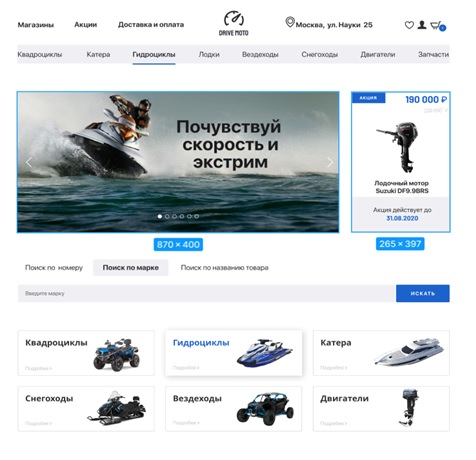
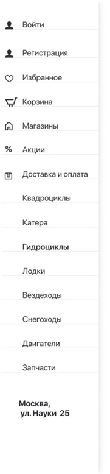
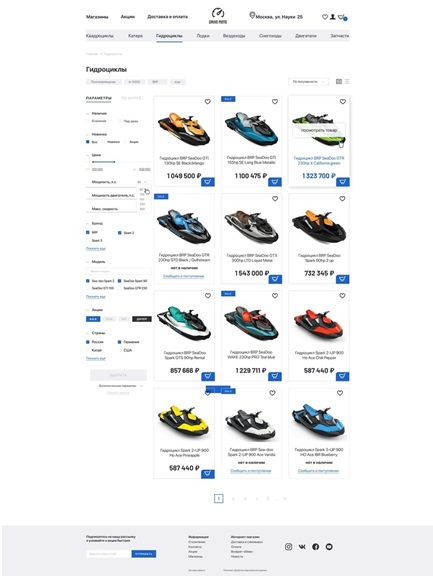
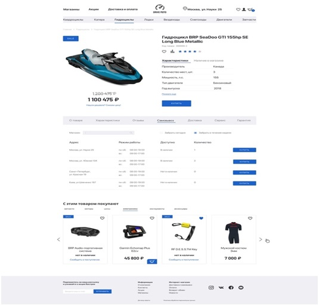

# Сайт по продаже техники
Сайт по продаже техники имеет большую актуальность в современном
мире, где технологии играют важную роль в повседневной жизни людей. С 
каждым годом на рынок выходит все больше новых устройств и технических 
новинок, которые становятся доступными для широкой аудитории. Поэтому 
сайты по продаже техники помогают людям быстро и удобно выбирать 
покупать необходимые устройства.

Чтобы заинтересовать пользователей, на сайте размещен каталог 
основных товаров, а также мотивирующие рекомендации к покупке товаров, 
которые они могу купить прямо сейчас. Также на сайте можно найти 
полезную информацию о технических характеристиках товаров, сравнить 
цены и условия доставки, а также получить консультацию специалистов.  

   
***[Рис. 1 – Стартовая страница и каталог сайта]***

В современном мире, где все больше людей делают покупки через 
интернет, сайты по продаже техники становятся все более популярными. Это 
связано с удобством и экономией времени при покупке товаров, а также с 
возможностью получить товары по более выгодным ценам. Поэтому сайты 
по продаже техники являются актуальными и востребованными в 
современном мире.

При разработке сайта применялись такие языки программирования
как ***JavaScript***, ***PHP***, ***Python***, ***MySQL*** и некоторые другие. Также 
учитывалась необходимость разметки ***HTML***, ***CSS***. Основным языком 
разработки сайта был выбран ***Python***, как гибкий, удобный для визуализации, 
быстрого прототипирования и написания алгоритмов язык. Для создания 
вспомогательной базы данных и работы с ней использовались методы языка 
***SQL***.   

Задачи: 
* изучение средств создания сайта;
* создание интерфейса сайта, удобного для будущих пользователей;
* составление базы данных для сайта-каталога, содержащую 
* интересную и актуальную информацию о технике; 
* разбиение информации по категориям и добавление на сайт 
* возможности поиска для удобства обращения пользователей к базе данных.  

Разрабатываемые компоненты сайта:
* главная страница (Рис. 1);   
* страница «По категориям» (Рис. 2);   
* страницы категорий (Рис. 3);   
* страницы товара (Рис. 4).   

  
***[Рис. 2 – Страница «По категориям»]***   
  
***[Рис. 3 – Страница категории]***
  
***[Рис. 4 – Страница товара]***

Благодаря использованию различных серверных и пользовательских 
элементов управления, применению каскадных таблиц стилей и тем 
оформления, удалось создать привлекательный, функциональный, удобный и 
интуитивно-понятный пользовательский интерфейс с возможностью быстрой 
модернизации в случае необходимости [2].

**Авторы работы**:  
*Frontend*  
* Едавкин С.И. 
* Прокопов В.А.   

*Backend*  
* Михайлов М.С.  
* Илюхин Е.В.